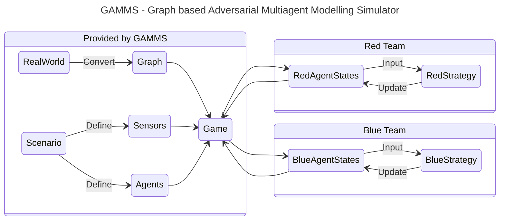

# GAMMS: Graph based Adversarial Multiagent Modelling Simulator

Simulating large simulations with multiple agents is a challenging task especially because the user needs to deal with understanding the nitty gritties of the various packages, the hardware and the environment. The primary reason for this is that there are multiple packages doing their own things and the user needs to define what they want to do and how they want to do it. This is a challenging task and requires a lot of effort.

We want to set a standard for simulating multiagent systems so that it becomes easier for others to replicate as well as add their own ideas to the mix. Most importantly, it also ensures that the exact scenario that we need to work on can be standardized and allow to compare not only the different strategies but also test the effectiveness of different strategies in different scenarios.

GAMMS is being proposed to solve the following problems:

1. Run large simulations involving multiple agents on an everyday laptop.
2. Provide a simple interface to the user to define the agents and the environment.
3. Allow the user to work with the agents and the environment without worrying about the underlying packages.
4. Create a simulater that is easy to use on any operating system (Windows, Mac, Linux) and is easy to install.

As shown in the diagram, the simulator will completely handle the conversion of real world data into a graph, the definition of the agents and the sensors and the running of the game. The user only needs to define the strategies for the agents that take the agent state as input and return the new agent state as output.

Things like scenarios, agents, sensors and the graph will be standardized so that the user can easily load the data and start working on the strategies.
